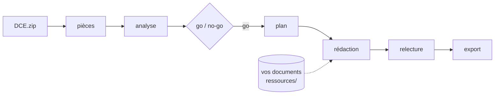

# Remporte CLI : répondre aux appels d'offres publics avec votre agent IA

<p align="center"></p>

[](https://github.com/Remporte-dev/remporte-appels-offres/actions/workflows/tests.yml)
[](https://pypi.org/project/remporte/)
[](https://github.com/Remporte-dev/remporte-appels-offres/blob/main/LICENSE)
[](https://github.com/Remporte-dev/remporte-appels-offres/blob/main/pyproject.toml)
[](#avec-claude-code)
[](#avec-codex-gemini-cli-pi-ou-un-autre-agent)

**Un CLI et un plugin pour Claude Code, Codex et ChatGPT Work, gratuits et open source, pour répondre à un marché
public français avec votre agent IA** : lecture du DCE, analyse, go/no-go, plan du mémoire
technique, rédaction, contrôle de conformité, relecture, formulaires DC1/DC2/DC4 et exports
Word, HTML et Excel.

Vous donnez le zip du DCE. Votre agent (Claude Code, Codex, Gemini CLI, Pi…) lit les pièces,
suit une méthode écrite par des gens qui répondent à des appels d'offres, et produit un
dossier de réponse que vous relisez. Les fichiers sont lus dans l’environnement choisi, qui peut être local ou cloud. Le raisonnement passe par votre fournisseur d’agent et suit ses conditions de traitement.

Un outil de [Remporte](https://remporte.fr/outils/agent-ia/?utm_source=github&utm_medium=readme&utm_content=entete),
le logiciel de réponse aux appels d'offres.

---

## Ce que vous obtenez

À partir d'un DCE (zip ou dossier : PDF, Word, Excel, OpenDocument, PowerPoint, CSV) :

| Fichier | Contenu |
|---|---|
| `01-pieces.md` | Inventaire des pièces reconnues (RC, CCAP, CCTP, CRT, AE, BPU, DPGF…), pièces illisibles, formats imposés par l'acheteur |
| `02-analyse.md` | Identité de la consultation, critères pondérés, exigences, pièces à remettre, clauses à risque, chaque point sourcé dans le DCE |
| `03-go-no-go.md` | Décision de répondre ou non, et ce qu'il faut réunir |
| `04-plan.md` | Plan du mémoire calé sur le cadre de réponse imposé, ou à défaut sur les critères |
| `sections/` | Le mémoire technique, une section par fichier, avec les preuves tirées de vos documents |
| `05-relecture.md` | Relecture avec la grille de notation de l'acheteur, par un agent qui n'a rien écrit |
| `candidature/` | DC1, DC2 et DC4 officiels remplis |
| `export/` | `memoire.docx`, `dossier.html`, `analyse.html`, `feuille-de-route.html`, `matrice-conformite.xlsx` |

Quand le cadre de réponse numérote ses exigences, `remporte cadre --couverture` liste celles
qu'aucune section ne traite encore. Un mémoire qui oublie une exigence perd des points sans
que personne ne le remarque : ce contrôle-là ne demande aucun modèle.

## Installation

```bash
uv tool install remporte
# ou : pipx install remporte
remporte --version
```

Python 3.10 ou plus récent ; `uv` l'installe tout seul si besoin. Testé automatiquement sous
macOS, Linux et Windows ; signalez-nous tout problème.

### Avec Claude Code

Le dépôt contient un plugin Claude Code (dossier [`plugin/`](https://github.com/Remporte-dev/remporte-appels-offres/tree/main/plugin)). Claude Code utilise les commandes `/remporte:init` et `/remporte:nouvel-ao`. Ces commandes sont propres à Claude Code. Claude Code et Cowork doivent disposer des commandes et de l’accès aux fichiers concernés.

```
/plugin marketplace add Remporte-dev/remporte-appels-offres
/plugin install remporte@remporte
```

Puis deux commandes :

- **`/remporte:init`**, une fois par environnement : vérifie l'installation, indexe les documents de
  votre entreprise et construit la fiche entreprise que liront tous les agents ;
- **`/remporte:nouvel-ao <DCE.zip>`**, pour chaque appel d'offres : crée le dossier et conduit
  le parcours avec vous, avec trois arrêts de validation (analyse, go/no-go, plan).

Exemples de demandes :

- `/remporte:init` : crée votre espace de travail et construit la fiche entreprise à partir de
  vos références, CV et certifications ;
- `/remporte:nouvel-ao ~/Téléchargements/DCE-voirie.zip` : lit le DCE, prépare l'analyse, le
  go/no-go et le plan du mémoire ;
- « Vérifie que chaque exigence du cadre de réponse est traitée dans le mémoire » ;
- « Remplis le DC1 et le DC2 pour ce marché ».

Le plugin fournit trois sous-agents, pour lire une fois et rédiger en parallèle sans épuiser
l'abonnement :

| Sous-agent | Rôle |
|---|---|
| `lecteur-dce` | Lit RC, CCAP, CCTP et annexes volumineuses une seule fois, écrit l'index et l'analyse |
| `redacteur-section` | Rédige une section du mémoire à partir du plan, de l'analyse et de vos documents |
| `relecteur` | Relit le mémoire terminé avec la grille de l'acheteur, sans l'avoir rédigé |

### Avec Codex et ChatGPT Work

Pour tester le plugin dans Codex depuis un clone de ce dépôt :

```bash
codex plugin marketplace add /chemin/vers/remporte-appels-offres
codex plugin add remporte@remporte
```

Ouvrez ensuite une nouvelle conversation et utilisez `$remporte:init` ou
`$remporte:nouvel-ao <chemin du DCE>`. Vous pouvez aussi demander « Aide-moi à répondre à
cet appel d'offres » : la skill `remporte:repondre-ao` prend le relais.

Le catalogue OpenAI est dans `.agents/plugins/marketplace.json`. Dans l'application
ChatGPT de bureau, choisissez cette source locale dans l'annuaire des plugins lorsqu'elle
est disponible. L'archive OpenAI peut aussi être importée comme plugin privé ou soumise
à l'annuaire ; sa création seule ne l'installe pas dans un compte ChatGPT.

ChatGPT Work doit disposer des commandes et des fichiers nécessaires. Vérifiez
`remporte --version` dans cet environnement ; l'installation du plugin n'installe pas
l'outil. Un environnement cloud ne voit que les fichiers qui y sont fournis. Une conversation
sans accès aux commandes ne peut pas exécuter ce parcours.

### Avec Gemini CLI, Pi ou un autre agent

Tout agent qui peut lancer des commandes et lire/écrire les fichiers concernés peut s’en servir :

```bash
remporte espace ~/Remporte                  # une fois : crée ressources/ et DCEs/
# déposez vos références, CV, certifications dans ~/Remporte/ressources/
cd ~/Remporte && remporte base indexer      # à refaire quand vos documents changent
remporte init ~/Téléchargements/DCE.zip     # crée DCEs/DCE/
cd DCEs/DCE && codex                        # ou claude, gemini, pi…
```

Chaque dossier contient un `AGENTS.md` (et
un `CLAUDE.md`) qui donne la marche à suivre à l'agent.

## Comment ça marche



| Étape | Fichier | Ce que fait l'agent | `remporte guide` |
|---|---|---|---|
| Pièces | `01-pieces.md` | Vérifie l'inventaire, signale les pièces illisibles | `pieces` |
| Analyse | `02-analyse.md` | Critères pondérés, exigences, pièces à remettre, clauses | `analyse` |
| Go/no-go | `03-go-no-go.md` | Décide s'il faut répondre | `go-no-go` |
| Plan | `04-plan.md` | Trame calée sur le cadre de réponse ou les critères | `plan` |
| Rédaction | `sections/` | Une section par fichier, preuves tirées de votre base | `redaction` |
| Relecture | `05-relecture.md` | Note le mémoire avec la grille de l'acheteur | `relecture` |
| Export | `export/` | Word, HTML, Excel | `export` |

`remporte etat` dit où en est le dossier et quelle est l'étape suivante. Le CLI fait sans
modèle tout ce qui peut l'être (conversion, recherche, contrôle de couverture, mise en page) ;
l'agent garde le raisonnement et l'écriture.

**Cas particuliers** pris en charge par `remporte guide` : limite de pages, réponse dans un
fichier Excel ou Word imposé par l'acheteur, soutenance orale (le support se prépare à partir
des fichiers de l'entreprise), formulaires de candidature.

## L'espace de travail

```
Remporte/
  ressources/                vos documents, fiche-entreprise.md, index de recherche
  DCEs/
    2026-05-mairie-voirie/   un dossier par appel d'offres
```

Un seul dossier, dans l’environnement choisi ou un dossier partagé accessible. On retrouve chaque réponse, son index et son analyse au même endroit.

## Les commandes

| Commande | Rôle |
|---|---|
| `remporte espace [chemin]` | Créer l'espace de travail (`ressources/`, `DCEs/`) |
| `remporte init <dce>` | Créer un dossier de réponse depuis un zip ou un dossier |
| `remporte etat` | Avancement et prochaine étape |
| `remporte guide [étape]` | Méthode de l'étape |
| `remporte pieces` | Inventaire des pièces |
| `remporte lire <type ou nom>` | Texte d'une pièce ; sommaire si elle est longue, puis `--page` |
| `remporte chercher "<termes>"` | Recherche dans tout le DCE |
| `remporte cadre [--couverture]` | Trame imposée par le cadre de réponse ; exigences non traitées |
| `remporte formats` | Soutenance, limite de pages, cadres Excel ou Word à compléter |
| `remporte candidature preparer\|remplir` | DC1, DC2, DC4 officiels |
| `remporte base indexer\|chercher` | Index et recherche dans les documents de l'entreprise |
| `remporte fiche [--creer]` | Fiche entreprise lue par tous les agents |
| `remporte exporter` | Mémoire Word, analyse et feuille de route HTML, matrice de conformité Excel |
| `remporte html <fichier.md>` | Mettre n'importe quel markdown en page HTML |
| `remporte offre` | Ce que fait Remporte en plus |

Toutes les commandes acceptent `--json`, pour qu'un agent lise un résultat structuré.

## Économiser son abonnement

- Une pièce longue se lit par son sommaire, puis page par page : sur un CCTP réel de
  523 000 caractères, le sommaire en fait 13 900.
- Les gros documents sont lus une seule fois, par un sous-agent, qui écrit un index que
  réutilisent toutes les étapes suivantes.
- `remporte guide modeles` indique la puissance de modèle utile à chaque étape, et quand
  confier une tâche à un modèle léger.

## Confidentialité

Le CLI s’exécute dans l’environnement où vous le lancez et lit les fichiers accessibles dans cet environnement. En local, ils peuvent être sur votre poste. En cloud, ils sont dans l’environnement cloud choisi et ne sont pas forcément présents sur votre poste. Le raisonnement est fait par votre agent, selon les conditions de son éditeur. Détails : [politique de confidentialité](https://remporte.fr/politique-confidentialite/#outil-agent-ia).

**Dépendance externe** : le plugin ne fournit pas le CLI `remporte`. Vérifiez sa présence avec `remporte --version`. S’il manque, `$remporte:init` ou `/remporte:init` propose `uv tool install remporte` et attend votre accord. Installer le plugin n’installe pas le CLI. Le plugin ne contient ni hook ni serveur MCP.

## Ce que le CLI ne fait pas

- Remplir l'acte d'engagement et le bordereau de prix (BPU, DPGF, DQE) dans le fichier de
  l'acheteur.
- Mettre le mémoire dans le modèle Word de votre entreprise.
- Donner les prix des marchés comparables déjà attribués.
- Lire les PDF scannés et les anciens fichiers Word `.doc` : ils sont signalés dans
  l'inventaire.
- Chercher des appels d'offres : il part du DCE que vous avez déjà.

Les trois premiers points sont ce que fait
[Remporte](https://remporte.fr/outils/agent-ia/?utm_source=github&utm_medium=readme&utm_content=ne-fait-pas#aller-plus-loin).

## Questions fréquentes

**Faut-il un compte ou une clé d'API ?** Non. Le CLI fonctionne seul, avec l'abonnement de
votre agent.

**Quels agents ?** Claude Code (plugin, commandes et sous-agents), Codex, Gemini CLI, Pi, et
tout agent qui sait lancer une commande et lire un fichier `AGENTS.md`.

**Marchés privés ?** Oui pour l'analyse, le plan, la rédaction et la relecture. Les
formulaires DC1, DC2 et DC4 ne concernent que la commande publique.

**Quel modèle ?** Un modèle de milieu de gamme suffit pour lire et rédiger ; la relecture et
le go/no-go gagnent à un modèle plus fort. Voir `remporte guide modeles`.

## Contribuer

Les signalements et propositions sont bienvenus dans les
[issues](https://github.com/Remporte-dev/remporte-appels-offres/issues). Pour le code :

```bash
git clone https://github.com/Remporte-dev/remporte-appels-offres && cd remporte-appels-offres
uv run pytest -q
```

Le CLI est dans `src/remporte/`. Le dossier `plugin/` contient les skills communes, les
procédures dans `references/`, les agents Claude dans `agents/`, et les manifests natifs
Claude et OpenAI. La méthode métier a une seule source ; chaque plateforme dispose de ses
points d'entrée et de ses métadonnées.

Pour produire les deux archives à partir de cette source :

```bash
uv run python scripts/package_plugin.py --platform claude --output dist/remporte-claude.zip
uv run python scripts/package_plugin.py --platform openai --output dist/remporte-openai.zip
```

L'archive Claude conserve ses agents et son manifeste. L'archive OpenAI inclut les six
skills et leurs métadonnées, les procédures communes et les manifests OpenAI. Les dépendances
du CLI sont déclarées dans `pyproject.toml` ; aucune n'est installée par l'archive du plugin.
Le script refuse d'écraser une archive existante.

Dépendances sous licences permissives uniquement (MIT, BSD, Apache).

## In English

**Remporte CLI** is an open-source command-line tool and Claude Code plugin that helps an AI
agent (Claude Code, Codex, Gemini CLI, Pi) answer **French public procurement tenders**
(*appels d'offres*, *marchés publics*): it reads the tender documents (DCE), extracts weighted
award criteria and requirements, drafts the technical proposal (*mémoire technique*) section by
section from your company documents, checks coverage of every numbered requirement, fills the
official DC1/DC2/DC4 forms, and exports to Word, HTML and Excel. Everything runs locally; no
account, no network calls. The method and outputs are in French.

## Licence

[MIT](https://github.com/Remporte-dev/remporte-appels-offres/blob/main/LICENSE). © Flowt (Remporte).
